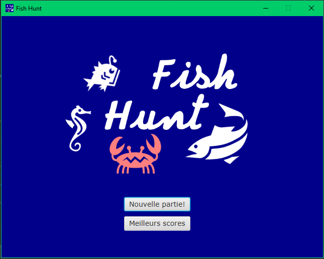
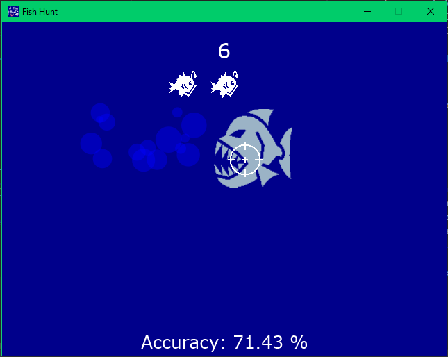
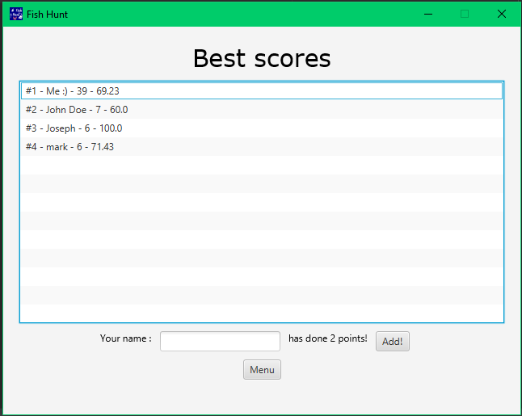

# FishHunt

A camera locked shooter game made with JavaFX from scratch for school.

I could maybe add some music.
## Table of content

- [Requirements](#requirements)
- [Getting started](#getting-started)
- [Game rules](#game-rules)
- [Screenshots](#screenshots)
- [Special thanks](#special-thanks)

## Requirements

- Java JDK 11 or later (latest recommended)
- JavaFX 11 or later

## Getting started

1. Download the Git repo using:

    ```
    git clone https://github.com/Hazot/FishHunt.git
    ```
   or download it manually.


3. Choose which way you want to run the program
   ####Recommended route
   If you want to run the code in an IDE, you need to:

    - have properly downloaded JavaFX.
    - set your Java JDK to the project configuration
    - add the JavaFX SDK as a library to the project
    - add to your VM arguments to your run configuration

   If you need more help towards setting up the environnement, visit: https://openjfx.io/openjfx-docs/#introduction.

   ####Other route
   If you want to run the code using command line and you need help, you can visit: https://openjfx.io/openjfx-docs/#install-javafx.
   
   I will probably setup a .jar and a build.xml in the future.

## Game rules

- There are fishes swimming from one side to another.
- You have to shoot the fishes using your mouse and try to not miss any before they disappear.
- Each fish fives you one point and the goal is to get the most amount of points, \
  but you can't just spam your click because you're accurace is
- If your good enough, there is an unlimited amount of rounds and the fishes get faster as you progress through the levels.
- You need to capture 5 fishes to go up a level.
- You have only 3 lives, meaning that the fishes can get out of the screen 3 times before you lose the game.
- Have fun!


## Screenshots

### Game menu


### Gameplay


### Best scores


## Special Thanks
- Alexis
